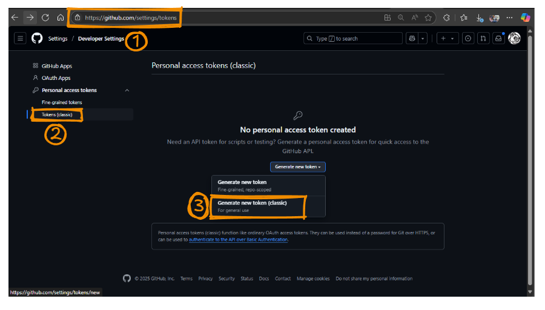

# 🚀 Quick Start Guide

## 3-Step Setup

### 1️⃣ Clone & Navigate
```bash
git clone https://github.com/dwdas9/self-hosted-github-runner.git
cd self-hosted-github-runner
```

### 2️⃣ Get GitHub Token
- Go to: https://github.com/settings/tokens
- Click "Generate new token (classic)"

    

- Select `repo` scope
- Copy the token

### 3️⃣ Run Setup
**Option A - Automated Setup (Recommended)**
```cmd
setup-runner.bat
```

**Option B - PowerShell**
```powershell
PowerShell -ExecutionPolicy Bypass -File setup-agent.ps1
```

**Option C - Manual**
```cmd
cd github-runner
copy .env.example .env
notepad .env
docker-compose up -d
```

## ✅ Verify
Check your GitHub repository → Settings → Actions → Runners

Your runner should appear as "Online" with a green dot! 🎉

---
📚 For detailed instructions, see the main [README.md](README.md)
